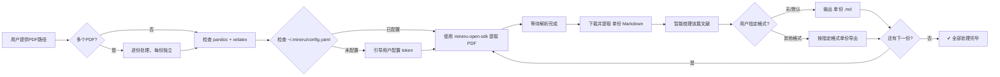
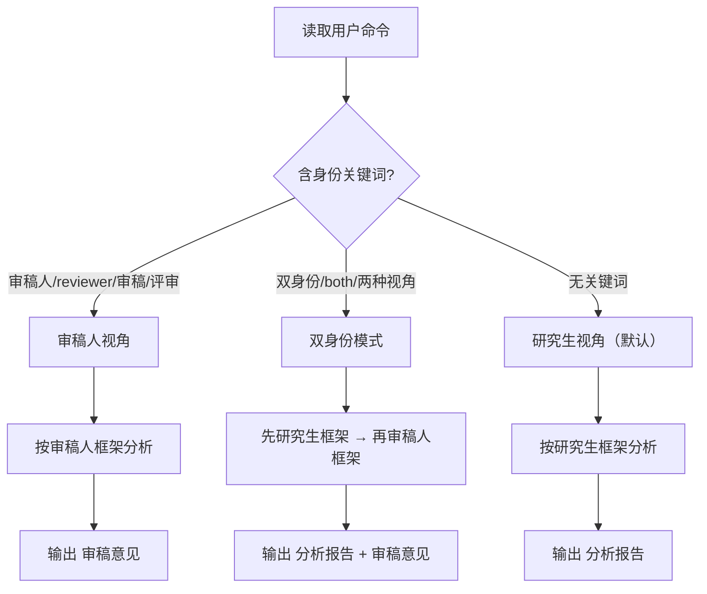

# ztt-pdf-read: PDF 翻译研究文献智能分析

## 工作流概览



---

> **⚠️ Windows 编码兼容**：该 skill 的脚本和输出使用 UTF-8 编码。
> 如果在 Windows Git Bash 中执行时遇到 `UnicodeEncodeError: 'gbk' codec can't encode character`
> 错误，请在命令前加 `PYTHONIOENCODING=utf-8`：
> ```bash
> PYTHONIOENCODING=utf-8 python script.py ...
> ```
> 脚本内部已做编码修复，大部分情况下不需要手动加前缀。如果仍有问题，手动设置即可。

---

## 第 1 步：检查 MinerU SDK 配置

**每次使用前必须检查 `~/.mineru/config.yaml` 是否存在且包含有效的 `token`。**

```python
from pathlib import Path

config_path = Path.home() / ".mineru" / "config.yaml"
if config_path.exists():
    token = None
    for line in config_path.read_text(encoding="utf-8").splitlines():
        if line.strip().startswith("token:"):
            token = line.split(":", 1)[1].strip().strip("'\"")
            break
    if token:
        print(f"[OK] MinerU SDK token 有效 (len={len(token)})")
    else:
        print("[WARN] token 为空")
else:
    print("[WARN] ~/.mineru/config.yaml 不存在")
```

### 如果未配置：

主动引导用户完成配置，**不要直接报错退出**。用友好语气告知：

> "使用 MinerU SDK 解析 PDF 需要配置 API Token。
>
> 请执行以下步骤：
>
> 1. 确保已安装 mineru-open-sdk：
>    ```bash
>    pip install mineru-open-sdk
>    ```
>
> 2. 创建配置文件：
>    ```bash
>    mkdir -p ~/.mineru
>    ```
>
> 3. 编辑 `~/.mineru/config.yaml`，写入：
>    ```yaml
>    token: '你的API密钥'
>    ```
>
> 4. 如果还没有密钥，请前往 https://mineru.net/apiManage/token 注册获取。
>
> 配置完成后重新运行即可。"

配置好后，继续执行后续步骤。

---

## 第 2 步：PDF → Markdown 转换（使用 mineru-open-sdk）

使用本 skill 的配套脚本 `scripts/ztt_pdf_extract.py` 完成转换。该脚本使用 `mineru-open-sdk` 的 `MinerU.extract()` 方法，自动完成上传 → 等待解析 → 下载全流程，无需手动处理轮询和 ZIP 解压。

### 单文件转换

```bash
# 方式一：直接执行（脚本内含编码修复，适用于大多数环境）
python .claude/skills/ztt-pdf-read/scripts/ztt_pdf_extract.py \
  "path/to/paper.pdf" \
  --output-dir ./ztt-output \
  --model vlm \
  --language ch

# 方式二：如果遇到 GBK 编码错误，加 PYTHONIOENCODING 前缀
PYTHONIOENCODING=utf-8 python .claude/skills/ztt-pdf-read/scripts/ztt_pdf_extract.py \
  "path/to/paper.pdf" \
  --output-dir ./ztt-output \
  --model vlm \
  --language ch
```

### ⚠️ 配合难度：文件名含特殊字符（如中文引号「"」「"」）

如果 PDF 文件名包含中文全角引号 `""` 或特殊符号，在 Bash 中传递时容易出错。**建议的做法：**

1. **重命名文件**，去掉特殊字符再处理（最稳妥）
2. 或在 Python 字符串中直接传递路径，避免 Bash 转义问题
3. 使用 `resolve()` 后的绝对路径

### 参数说明

| 参数 | 默认值 | 说明 |
|------|--------|------|
| `--model` | `vlm` | 模型版本：`pipeline` / `vlm` / `html` |
| `--ocr` | 关闭 | 对扫描件启用 OCR |
| `--language` | `ch` | 文档语言（中文论文默认 `ch`；英文用 `en`）|
| `--no-formula` | 开启公式识别 | 禁用公式识别 |
| `--no-table` | 开启表格识别 | 禁用表格识别 |
| `--pages` | 全部 | 页码范围，如 `"1-10,15"` |
| `--output-dir` | `./ztt-output` | 输出目录 |

> **注意**：`ztt_pdf_extract.py` 不支持 `--timeout` 参数，解析超时由脚本内部默认控制（~5 分钟）。如需处理大文件，建议用 `--pages` 分批。

### 转换完成后的输出

脚本会在输出目录生成：
- `<文件名>.md` — 最终的 Markdown 文件（核心产物，含图片引用）

### 每次操作结束后的余额报告

**每次处理完一份 PDF，脚本会自动报告以下当日用量信息：**

```
📊 ── 当日 API 用量 ─────────────────────
   已用页数:     12
   剩余可处理页数: 1988 (日限额 2000 页)
   已处理文件数:  3
   📌 注: 超出限额后解析优先级会降低，但仍可继续使用
──────────────────────────────────────
```

- 数据记录在 `.claude/skills/ztt-pdf-read/daily_usage.json`（按日期自动管理）
- 自动清理 30 天前的历史记录
- 日限额基于 MinerU 免费账号的 **2000 页/天** 标准
- 超出限额后不影响使用，只是解析优先级下降

### 错误处理

- **Token 无效/未配置**：引导用户配置 `~/.mineru/config.yaml`
- **mineru-open-sdk 未安装**：自动提示 `pip install mineru-open-sdk`
- **文件过大** (>200MB)：提示 mineru-open-sdk 限制 200MB/600页，建议拆分
- **解析失败**：检查 PDF 是否加密、损坏或为扫描件（尝试启用 `--ocr`）
- **超时**：如果解析超时（`ztt_pdf_extract.py` 内部默认约 5 分钟），建议：
  - 使用 `--pages` 分页处理（如 `--pages "1-20"`）
  - 切换 `--model pipeline`（更快但精度略低）
  - 检查网络连接或稍后重试

---

## 第 3 步：选择分析身份（Perspective Selection）

**这是 skill 的核心特性**——根据用户意图自动选择或手动切换分析视角。

### 身份选择规则

| 触发条件 | 默认身份 | 手动切换命令 |
|---------|---------|------------|
| 用户未指定视角 | ✅ **研究生视角**（学习理解导向） | — |
| 命令中含"审稿人""reviewer""审稿" | — | `/ztt-pdf-read 审稿人视角` |
| 命令中含"切换身份"或"双身份" | — | 询问用户具体需求 |

### 身份判定流程

1. **解析用户输入**：检查用户消息中是否含有身份关键词
   - 审稿人触发词：`审稿人`、`reviewer`、`审稿`、`review`、`评审`、`审阅`、`评判`
   - 双身份触发词：`双身份`、`两种视角`、`both`（此时要求用户先指定，或依次输出两份报告）
2. **无关键词** → 默认使用 **研究生视角**
3. **有明确关键词** → 切换到对应身份
4. **用户同时要求两种视角** → 先输出研究生视角报告，再输出审稿人视角报告，两份独立文件

---

## 第 3-A 步：研究生视角 — 翻译研究文献智能梳理

**适用场景**：课程作业、文献综述、开题报告、资格考试、自学理解

获取 Markdown 原文后，以**学习者**身份通读全文，按以下框架提取信息。目标是帮助用户**理解、消化和吸收**文献内容。

### 输出结构（研究生视角）

```markdown
# [文献标题]
> 📖 **分析身份：研究生视角** — 以学习理解为导向

## 一、摘要（Abstract）
> 用 200-300 字精炼概括全文核心内容，包括研究背景、目的、方法、结果和结论。
> **注意**：这里不是简单地复制原文摘要，而是结合全文内容做综合提炼。
> 如果原文有英文摘要，保留中英双语对照。

## 二、文献综述（Literature Review）
> 梳理作者引用的主要理论框架和前人研究：
> - 作者站在哪些理论和前人研究的基础上？
> - 引用了哪些关键学者和流派？
> - 作者指出的研究空白（research gap）是什么？
> - 与翻译研究领域的关联（如：等效理论、功能主义、后殖民翻译、语料库翻译研究等）

## 三、研究问题（Research Questions）
> - 明确的罗列研究问题/假设（RQ1, RQ2, ...）
> - 如果原文没有明确写出，根据研究目的推断并标注"推断"

## 四、研究方法（Research Methods）
> - 研究设计类型（定性/定量/混合方法/案例研究/实验等）
> - 数据来源（语料库、问卷、访谈、实验文本等）
> - 数据收集过程
> - 数据分析方法
> - 研究的信度和效度说明（如有）

## 五、研究结果（Research Results）
> - 主要发现（分点列出）
> - 数据支持（引用关键数据、统计结果、例证）
> - 与研究问题的对应关系

## 六、讨论与评价
> - 作者对结果的解释
> - 研究局限性
> - 对未来研究的建议
> - 从学习者角度：我从这篇文献学到了什么？哪些方法可以借鉴到自己的研究中？

## 七、关键术语与概念（可选）
> 列出文中的核心术语及其定义，帮助快速查阅。
```

---

## 第 3-B 步：审稿人视角 — 翻译研究文献同行评审

**适用场景**：期刊审稿、学位论文评阅、课题评审、质量评估

获取 Markdown 原文后，以**审稿人**身份对文献进行专业评估。目标是帮助用户**评判文献质量和贡献**，形成可提交的审稿意见。

### 核心立场

作为审稿人，你需要对文献做出**独立的专业判断**，而非复述或学习其内容。重点关注：
- 研究的原创性（Originality）与贡献度
- 方法论的严谨性（Methodological Rigor）
- 论证逻辑的一致性（Argumentative Coherence）
- 证据的充分性（Evidential Sufficiency）
- 写作与呈现质量（Presentation Quality）

### 输出结构（审稿人视角）

```markdown
# 审稿意见：[文献标题]
> 🎯 **分析身份：审稿人视角** — 以评估评判为导向

## 一、总体评价（Overall Assessment）
> **推荐意见**：[接收 / 小修 / 大修 / 拒稿]
>
> **一句话总结**：用一句话概括本文的核心贡献和总体质量。
>
> **创新性评分**：⭐ 1-5（1=无新意，5=重大突破）
> **方法论评分**：⭐ 1-5（1=严重缺陷，5=严谨完善）
> **写作质量评分**：⭐ 1-5（1=难以卒读，5=清晰优美）
>
> **综合推荐理由**：简要说明推荐意见的核心依据。

## 二、研究问题与创新性评估（Originality Assessment）
> - 研究问题是否明确、新颖、有意义？
> - 该研究与已有文献的关系交代是否充分？
> - **核心贡献**是什么？是否存在实质性的理论/方法/实证推进？
> - 是否存在「宣称的创新」与「实际贡献」之间的落差？
> - 对于翻译研究领域而言，本文的价值和意义何在？

## 三、方法论评估（Methodological Review）
> - 研究设计是否适切于研究问题？
> - 数据来源、样本量、语料规模是否充分且具有代表性？
> - 分析方法是否合理、可复现？分析步骤描述是否充分？
> - 信度与效度问题（如：编码一致性、译者背景控制、统计方法选择等）
> - **关键缺陷**（如有）：指出方法论上的致命或重大瑕疵

## 四、论证与证据评估（Argument & Evidence）
> - 研究发现是否能充分支持结论？
> - 是否存在过度推论（overclaiming）或证据不足的情况？
> - 反例或替代解释是否得到考虑和讨论？
> - 论证链条是否存在断裂或逻辑跳跃？
> - 数据呈现是否清晰、准确、无误导？

## 五、具体修改意见（Specific Comments）
> 按重要程度排序，逐条列出：
> 1. **[强制性修改]** 必须解决的问题（如：方法论缺陷、数据错误、逻辑矛盾）
> 2. **[建议性修改]** 建议改进之处（如：补充分析、扩展讨论）
> 3. **[细节修正]** 文字、格式、引用等细节问题
>
> 每条意见标注出现位置（页码/段落），并说明理由。

## 六、写作与呈现质量（Presentation）
> - 结构是否合理、逻辑清晰？
> - 语言表达是否准确、流畅？
> - 图表/表格是否清晰、必要、自明？
> - 引用是否充分、准确、规范？

## 七、总结与建议（Summary & Recommendation）
> **最终推荐意见**：[接收 / 小修 / 大修 / 拒稿]
>
> **接收条件**（如为大修/拒稿）：明确说明需要满足哪些条件。
>
> **给编辑部的说明**（如适用）：简要、专业的内部评审意见。
>
> **给作者的建议**：建设性的改进方向，语气专业但不失尊重。
```

### 审稿人行为准则

1. **公正客观**：基于文献本身做出判断，不因个人偏好或学术流派偏见影响评价
2. **证据为本**：每条批评必须有具体依据，标注文献中的位置
3. **建设性**：负面评价必须伴随改进建议，避免单纯的否定
4. **专业语气**：使用"建议作者考虑…""论证可进一步加强…"等表达，而非武断否定
5. **区分等级**：明确区分"必须修改"和"建议修改"的界限
6. **识别亮点**：即使总体评价不高，也应指出文献的可取之处

---

## 第 3-C 步：双身份综合模式（可选）

当用户要求"两种视角都要"时，依次执行以下流程：

1. **先**以研究生视角输出 `[文件名]_分析报告.md`（框架见 3-A）
2. **再**以审稿人视角输出 `[文件名]_审稿意见.md`（框架见 3-B）
3. 两份文件各自独立保存

---

## 通用分析原则（两身份共享）

1. **忠实原文**：所有提取的信息必须有原文依据，不凭空杜撰
2. **专业深度**：使用翻译研究领域的专业术语（而非泛泛的通用表述）
3. **结构清晰**：保持各自框架，便于后续导出和阅读
4. **中英双语**：如果原文是英文，关键术语保留英文原文（如：Skopos theory 目的论）

---

## 第 4 步：输出文件

### 默认行为：纯 Markdown 输出

本 skill **默认不编译 PDF**，仅输出 Markdown 格式的分析报告。用户可以根据需要自行编译。

### 输出文件命名

| 身份 | 输出文件 |
|------|---------|
| 研究生视角（默认） | `[原PDF文件名]_分析报告.md` |
| 审稿人视角 | `[原PDF文件名]_审稿意见.md` |
| 双身份模式 | 两份分别输出：`..._分析报告.md` + `..._审稿意见.md` |

例如：`翻译伦理研究_分析报告.md`（研究生视角）、`翻译伦理研究_审稿意见.md`（审稿人视角）

建议将输出保存在用户指定的目录，或与原 PDF 同目录下的 `ztt-output/` 子目录中。

### 其他格式

如果用户明确要求 PDF、DOCX、HTML 等其他格式，则由 AI 根据情况自行选择方案输出。

---

## 完整处理流程（一次性全部执行）

### 身份判定流程图



### 单份 PDF 的标准流程

每份 PDF 独立经历以下完整链路，绝不交叉：

```bash
# ===== 处理 paper.pdf（单份） =====

# 0️⃣ 检查并自动安装依赖（缺失则自动装）
command -v pandoc &>/dev/null || winget install Pandoc 2>/dev/null
python3 -c "import weasyprint" &>/dev/null || pip install weasyprint 2>/dev/null
PDF_ENGINE=""; command -v xelatex &>/dev/null && PDF_ENGINE=xelatex
[[ -z "$PDF_ENGINE" ]] && command -v wkhtmltopdf &>/dev/null && PDF_ENGINE=wkhtmltopdf
[[ -z "$PDF_ENGINE" ]] && python3 -c "import weasyprint" &>/dev/null && PDF_ENGINE=weasyprint
echo "🔧 PDF引擎: ${PDF_ENGINE:-无}"

# 0️⃣ 判定分析身份（研究生/审稿人/双身份）
# 检查用户是否指定了审稿人视角...

# 1. 转换 PDF → Markdown（使用本 skill 的提取脚本）
PYTHONIOENCODING=utf-8 python .claude/skills/ztt-pdf-read/scripts/ztt_pdf_extract.py \
  "paper.pdf" --output-dir ./ztt-output --model vlm --language ch

# 2. 读取生成的 Markdown 并做智能分析
# 研究生视角 → 读取 ./ztt-output/paper.md，按第3-A步框架梳理
# 审稿人视角 → 读取 ./ztt-output/paper.md，按第3-B步框架梳理
# 双身份     → 先后运行两遍分析

# 3. 将分析结果保存为独立的 Markdown 文件
# 研究生视角 → ./ztt-output/paper_分析报告.md
# 审稿人视角 → ./ztt-output/paper_审稿意见.md
# 双身份     → 两份分别保存

# 4. 编译为独立的 PDF（目录自动单独成页，表格自动缩放适应页宽）
TOC_HEADER=".claude/skills/ztt-pdf-read/scripts/toc-newpage.tex"
# 研究生视角
pandoc ./ztt-output/paper_分析报告.md \
  -o ./ztt-output/paper_分析报告.pdf \
  --pdf-engine=xelatex --toc \
  -V mainfont=SimSun -V monofont="Courier New" \
  -V geometry:margin=2cm -V geometry:a4paper -V fontsize=10pt \
  --include-in-header="$TOC_HEADER"
# 审稿人视角
pandoc ./ztt-output/paper_审稿意见.md \
  -o ./ztt-output/paper_审稿意见.pdf \
  --pdf-engine=xelatex --toc \
  -V mainfont=SimSun -V monofont="Courier New" \
  -V geometry:margin=2cm -V geometry:a4paper -V fontsize=10pt \
  --include-in-header="$TOC_HEADER"

# ✅ paper.pdf 处理完毕
# 同时自动报告当日余额：
#   📊 已用 12 页，剩余 1988 页（日限额 2000 页）
```

### 多份 PDF 的流程

```bash
# ===== 每份 PDF 独立处理，各自根据身份生成对应文件 =====

# paper1.pdf（研究生视角）→
#   ztt-output/paper1.md
#   ztt-output/paper1_分析报告.md
#   ztt-output/paper1_分析报告.pdf

# paper2.pdf（审稿人视角）→
#   ztt-output/paper2.md
#   ztt-output/paper2_审稿意见.md
#   ztt-output/paper2_审稿意见.pdf

# paper3.pdf（双身份）→
#   ztt-output/paper3.md
#   ztt-output/paper3_分析报告.md + .pdf
#   ztt-output/paper3_审稿意见.md + .pdf
```

**再次强调：在任何情况下，一个 `.md` 文件都只对应一份 PDF 的内容，绝不混装。**

---

## 注意事项

### Windows 编码经验

Windows Git Bash 的默认输出编码为 GBK，而 Python 脚本中的 UTF-8 字符（如 emoji、中文）输出到终端时会报 `UnicodeEncodeError`。**脚本已内置编码修复**（设置 stdout/stderr 为 UTF-8），但如果错误仍然出现：

```bash
# 手动指定编码
PYTHONIOENCODING=utf-8 python script.py ...

# 或在 Bash 中设置别名持久化
alias python3="PYTHONIOENCODING=utf-8 python3"
```

### ⚠️ 文件名含特殊字符的处理

部分中文 PDF 文件名包含全角引号（`"` `"`）或其他特殊符号，在 Bash 中传递时容易出错。推荐的做法：

1. **重命名文件**（最稳妥）：去掉特殊字符再处理
2. 在 Bash 中**用单引号包裹路径**，并在 Python 脚本中使用 `Path.resolve()` 解析
3. 直接使用**绝对路径**而非相对路径
4. 如果文件名包含引号 `"` `"`，Bash 双引号内的这些字符会被正确传递，Python 端的 `Path.resolve()` 能正常处理

### 路径说明

脚本的 `pdf_path` 和 `--output-dir` 参数：

- 支持**绝对路径**（推荐）：`C:/Users/xxx/paper.pdf` 或 `/c/Users/xxx/paper.pdf`
- 支持**相对路径**：相对于当前的**工作目录（cwd）**，而不是脚本所在目录
- 如果 Bash 的当前工作目录不是您预期的位置，请使用绝对路径避免混淆

### 依赖检查

在执行前检查所需工具是否可用：

```bash
# 检查 mineru-open-sdk（核心依赖）
PYTHONIOENCODING=utf-8 python3 -c "from mineru import MinerU; print('✅ mineru-open-sdk 可用')" || pip install mineru-open-sdk

# 检查 pandoc（用于 PDF 编译）
pandoc --version || echo "请安装 pandoc: https://pandoc.org/installing.html"
```

### MinerU API 限制（通过 SDK 调用）

- 单文件 ≤ 200MB，≤ 600 页
- 上传链接有效期 24 小时，解析结果保存 30 天
- 免费版 API 有调用频率限制，如遇限速请稍后重试
- SDK 的 `extract()` 方法内置自动轮询，无需手动处理
- 解析超时由脚本内部默认控制（约 5 分钟），大文件建议使用 `--pages` 分批处理

### 日用量跟踪说明

- 脚本使用 `daily_usage.json` 文件记录每日用量，存放在本 skill 目录下（`.claude/skills/ztt-pdf-read/daily_usage.json`）
- 每次处理完 PDF 自动报告：已用页数、剩余可处理页数、已处理文件数
- 日限额基于 MinerU 免费账号 **2000 页/天**，超出后仅降级优先级不影响使用
- 此跟踪为本地估算，实际余额以 MinerU 官网控制台为准
- 如果更换了 API Key，可手动删除 `daily_usage.json` 重置统计

### 中文 PDF 特别说明

- 中文 PDF 默认使用 `ch` 语言参数，不要改
- PDF 编译时使用 `SimSun`（宋体）作为正文字体，确保中文字符正常显示
- 如果系统没有 SimSun，尝试使用其他中文字体，或使用 `--pdf-engine=wkhtmltopdf`（内置中文字体支持更好）
